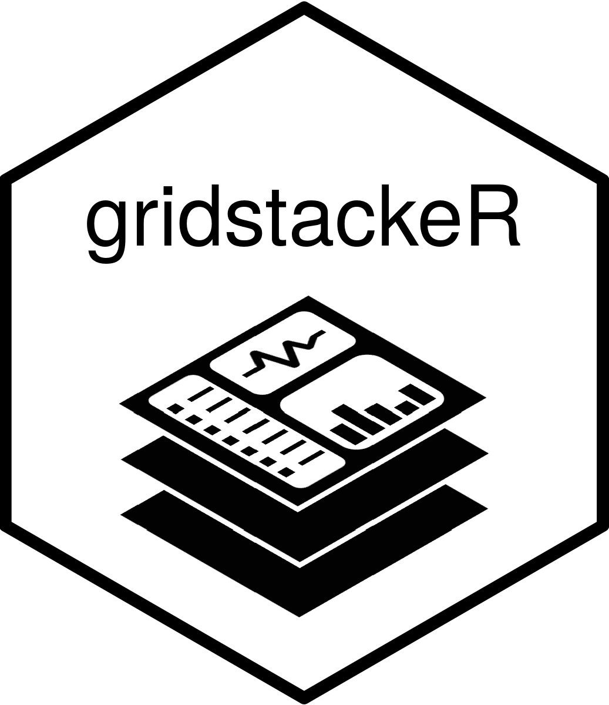

<!-- README.md is generated from README.Rmd. Please edit that file -->


```{r, include = FALSE}
knitr::opts_chunk$set(
  collapse = TRUE,
  comment = "#>",
  fig.path = "man/figures/README-",
  out.width = "100%"
)
```

# gridstackeR <a></a>

The gridstackR package allows users to easily create Dashboards with [gridstack.js](https://gridstackjs.com/) functionalities 

'gridstack.js is [...] designed to help developers create beautiful draggable, resizable, responsive [...] layouts with just a few lines of code'


## Installation
You can install the development version from [GitHub](https://github.com/) with:

``` r
# install.packages("devtools")
devtools::install_github("petergandenberger/gridstackeR")
```

## Example

In the example below we add gridstackR to the basic shiny application 'Old Faithful Geyser'.
The plot can now be dynamically resized and the position for both, the plot and the slider, can be changed using simple drag&drop.

```{r, eval=FALSE}
library(shiny)
library(gridstackeR)
ui <- fluidPage(
  grid_stack(
    grid_stack_item(
      h = 4, w = 4, id = "plot_container", style = "overflow:hidden",
      shinydashboard::box(
        title = "Histogram", status = "primary", solidHeader = TRUE,  width = 12, height = "100%",
        plotOutput("plot", height = "auto")
      )
    ),
    grid_stack_item(
      h = 3, w = 4, minH = 3, maxH = 3, id = "slider", style = "overflow:hidden",
      shinydashboard::box(
        title = "Inputs", status = "warning", solidHeader = TRUE, width = 12, height = "100%",
        sliderInput("slider", "Slider input:", 1, 100, 50)
      )
    )
  )
)

server <- function(input, output) {
  output$plot <- renderPlot({
    x    <- faithful$waiting
    bins <- seq(min(x), max(x), length.out = input$slider + 1)

    hist(
      x, breaks = bins, col = "#75AADB", border = "white", 
      xlab = "Waiting time to next eruption (in mins)", 
      main = "Histogram of waiting times"
    )
  },
  # set the height according to the container height (minus the margins)
  height = function() {
    min_height <- 150
    margin <- 80
    max(input$plot_container_height - margin, min_height)
  })
}

shinyApp(ui, server)
```


