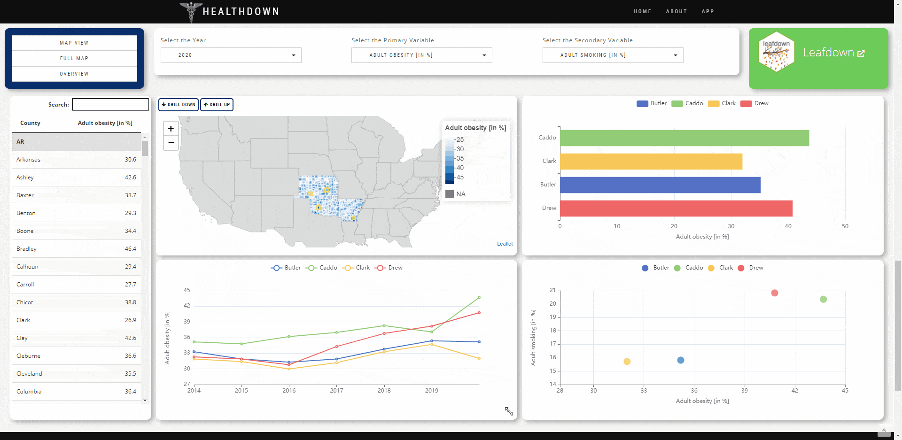

<!-- README.md is generated from README.Rmd. Please edit that file -->


```{r, include = FALSE}
knitr::opts_chunk$set(
  collapse = TRUE,
  comment = "#>",
  fig.path = "man/figures/README-",
  out.width = "100%"
)
```

# gridstackeR
The gridstackeR package allows users to easily create Dashboards with [gridstack.js](https://gridstackjs.com/) functionalities 

'gridstack.js is [...] designed to help developers create beautiful draggable, resizable, responsive [...] layouts with just a few lines of code'



## Installation
You can install the development version from [GitHub](https://github.com/) with:

``` r
# install.packages("devtools")
devtools::install_github("petergandenberger/gridstackeR")
```

## Example

In the example below we add gridstackeR to the basic shiny application 'Old Faithful Geyser'.
The plot can now be dynamically resized and the position for both, the plot and the slider, can be changed using simple drag&drop.

```{r, eval=FALSE}
library(shiny)
library(gridstackeR)
ui <- fluidPage(
  grid_stack(
    grid_stack_item(
      h = 4, w = 4, id = "plot_container",
      shinydashboard::box(
        title = "Histogram", status = "primary", solidHeader = TRUE,  width = 12, height = "100%",
        plotOutput("plot", height = "auto")
      )
    ),
    grid_stack_item(
      h = 3, w = 4, min_h = 3, max_h = 3, id = "slider",
      shinydashboard::box(
        title = "Inputs", status = "warning", solidHeader = TRUE, width = 12, height = "100%",
        sliderInput("slider", "Slider input:", 1, 100, 50)
      )
    )
  )
)

server <- function(input, output) {
  output$plot <- renderPlot({
    x    <- faithful$waiting
    bins <- seq(min(x), max(x), length.out = input$slider + 1)

    hist(
      x, breaks = bins, col = "#75AADB", border = "white", 
      xlab = "Waiting time to next eruption (in mins)", 
      main = "Histogram of waiting times"
    )
  },
  # set the height according to the container height (minus the margins)
  height = function() {
    min_height <- 150
    margin <- 80
    max(input$plot_container_height - margin, min_height)
  })
}

shinyApp(ui, server)
```

## Usage

In the ```ui.R``` file, create a grid using ```grid_stack(...)``` and place grid-stack-items inside using ```grid_stack_item(...)```.

Specify options like height, width, x-, y-position as well. Check the [gridstack.js documentation](https://github.com/gridstack/gridstack.js/tree/master/doc#item-options) for a full list of options.

The ```ui.R``` file might contain something like the following.
```{r, eval=FALSE}
grid_stack(
  grid_stack_item(
    h = 4, w = 4, id = "plot_container",
    shinydashboard::box(
      title = "Histogram", status = "primary", solidHeader = TRUE,  width = 12, height = "100%",
      plotOutput("plot", height = "auto")
    )
  )
)
```

## Dynamic figure height

Elements inside ```grid-stack-item``` might not change their height automatically.

### Setting the height dynamically using callbacks
The following example shows how the height of the plot can be set dynamically using the ```<id>_height``` callback

Note: the ```plot_container_height``` references the height of the ```id = "plot_container"``` created in the ```ui.R``` example above.


```{r, eval=FALSE}
output$plot <- renderPlot({
    x    <- faithful$waiting
    bins <- seq(min(x), max(x), length.out = input$slider + 1)

    hist(
      x, breaks = bins, col = "#75AADB", border = "white", 
      xlab = "Waiting time to next eruption (in mins)", 
      main = "Histogram of waiting times"
    )
  },
  # set the height according to the container height (minus the margins)
  height = function() {
    min_height <- 150
    margin <- 80
    max(input$plot_container_height - margin, min_height)
  }
)
```


### Setting the height for [DT::dataTableOutput](https://rstudio.github.io/DT/)
The height for a ```DT::dataTableOutput``` can be set as in the following example.

ui.R
``` {r, eval=FALSE}
grid_stack_item(
        w = 4, h = 10, x = 0, y = 0, id =  "c_table",
        DT::dataTableOutput("mytable")
      )
``` 

server.R
``` {r, eval=FALSE}
output$mytable <- DT::renderDataTable({
    DT::datatable(mtcars, options = list(
      # set the height according to the container height (minus the margins)
      scrollY = max(input$c_table_height, 200) - 110, paging = FALSE
      )
    )
  })
```

### Setting the height for [echarts4r](https://github.com/JohnCoene/echarts4r)
The height for a ```echarts4r::echarts4rOutput``` can easily be set using the ```height="100%"``` option.

ui.R
``` {r, eval=FALSE} 
grid_stack_item(
 w = 5, h = 5, x = 7, y = 0, id = "c_plot",
 echarts4rOutput(outputId =  "plot", height = "100%")
)
``` 


